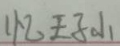
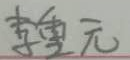
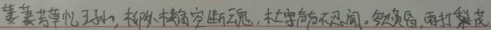
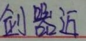
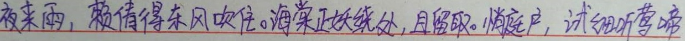
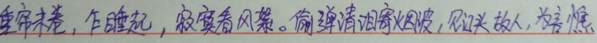
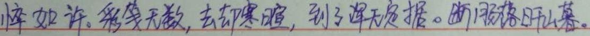

# CRNN(CNN+RNN+CTCLoss)
Text recognition

# 如何去测试

1.加载模型，将模型放入./model/中

download the model from https://pan.baidu.com/s/1yCxzZE0qugHL-FZRHeW3CA

2.向test_img_list中添加需要测试的图片列表

    test_img_list = ['/home/tony/ocr/test_data/00023.jpg']

3.运行模型

    python3 test_crnn.py
 
 
# 如何去train
1.处理train 数据集

    python3 ./utils/make_data.py

2.训练网络
    
    python3 train.py   
    
    
| Prediction 	| Image 	|
|------------	|-------	|
| 忆王子山 	|  	|
| 李重元 	|  	|
| 萋萋芳草忆王孙。柳楼空断魂，未字声昏不无闲。欲黄昏，雨打我花 |  	|
| “闲门】 |  	|
| 剑熊近 |  	|
| 袁去华 |  	|
| 夜来雨，赖倚得东风吹住。海棠正娥绕处，且留取。悄庭户，试细听莺啼 |  	|
| 燕，分明共人愁绪，怕春去。佳树翠阴初转年。 |  	|
| 重帘未卷，乍睡起，寂寞看风絮。偷弹清泪寄烟波，欲头故，为言憔 |  	|
| 悴如许。彩笺无数，去却寒腰，到了深无是携。断月落日山暮。 |  	|
